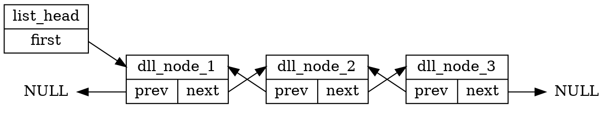
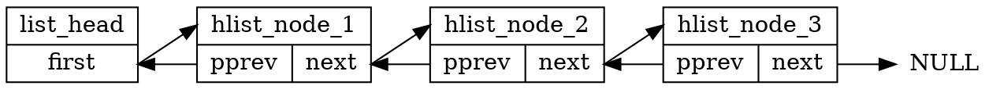
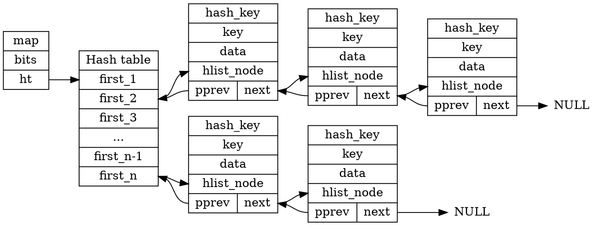

# 2022q1 Homework1(quiz1)

###### tags: `Linux Kernel 2022 spring`

## 作業要求

[2022q1 第 1 週測驗題](https://hackmd.io/@sysprog/linux2022-quiz1)

- [ ] 重新回答[第 1 周測驗題](https://hackmd.io/@sysprog/linux2022-quiz1)從測驗一到測驗四，附帶的「==延伸問題==」也需要完成
    - 解釋程式運作原理時，應提供對應的 Graphviz 圖例，可參照 Linked List 題目 1 + 分析
- [ ] 比照 [課前測驗參考解答: Q1](https://hackmd.io/@sysprog/bitwise-reverse?type=view), [Linked list 題目分析](https://hackmd.io/@LinYunWen/HyELy5bTz?type=view) 和 [參考題解](https://hackmd.io/@RinHizakura/BysgszHNw) 的模式來撰寫共筆，需要詳細分析自己的思路、參閱的材料 (以第一手材料為主，包含 C 語言規格書的章節)，以及==進行相關實驗。==

## 測驗1

>題意是給定一個陣列 `nums` 和一個目標值 `target`，求找到 `nums` 的 2 個元素相加會等於 `target` 的索引值。題目確保必為單一解，且回傳索引的順序沒差異。例如給定輸入 `nums = [2, 7, 11, 15]`, `target = 9`，相加變成 `9` 的元素僅有 `2` 及 `7`，因此回傳這二個元素的索引值 `[0, 1]`


### 先來 trace 一下暴力法

`qsort`
根據 ==C語言規格書== 7.20.5.2 The qsort function
>The **qsort** function sorts an array of **nmemb** objects, the initial element of which is pointed to by **base**. The size of each object is specified by **size**.

>The contents of the array are sorted into ascending order according to a comparison function pointed to by **compar**, which is called with two arguments that point to the objects being compared. The function shall return an integer less than, equal to, or greater than zero if the first argument is considered to be respectively less than, equal to, or greater than the second.

根據 `compar` 這個函數來進行排序，這個函數包含兩個參數指向需要被比較的 `object` 需要 `return`一個整數是小於，等於或大於 0 ，分別代表第一個參數，少於，等於或大於第二個參數。

`cmp`
```c
static int cmp(const void *lhs, const void *rhs) {
    if (*(int *) lhs == *(int *) rhs)
        return 0;
    return *(int *) lhs < *(int *) rhs ? -1 : 1;
}
```

如果相等，回傳 `0` 第一個參數小於第二個參數則回傳 `-1`，反之回傳 `1`

此函數作為 `qsort` 的其中一個引數

`alloc_wrapper`
```c
static int *alloc_wrapper(int a, int b, int *returnSize) {
    *returnSize = 2;
    int *res = (int *) malloc(sizeof(int) * 2);
    res[0] = a, res[1] = b;
    return res;
}
```

作為 `twoSum` 的回傳值，將引數 `a`，`b` 以 `res` 包起來並回傳。

`twoSum`
```c
int *twoSum(int *nums, int numsSize, int target, int *returnSize)
{
    *returnSize = 2;
    int arr[numsSize][2];  /* {value, index} pair */
    for (int i = 0; i < numsSize; ++i) {
        arr[i][0] = nums[i];
        arr[i][1] = i;
    }
    qsort(arr, numsSize, sizeof(arr[0]), cmp);
    for (int i = 0, j = numsSize - 1; i < j; ) {
        if (arr[i][0] + arr[j][0] == target)
            return alloc_wrapper(arr[i][1], arr[j][1], returnSize);
        if (arr[i][0] + arr[j][0] < target)
            ++i;
        else
            --j;
    }
    *returnSize = 0;
    return NULL;
}      
```
先將 `nums` 排序
由 `nums` 的前後一起開始迭代，如果找到答案則進入 `alloc_wrapper` 且回傳答案。
- 如果小於目標值，則將左值迭代成新的更大的值
- 如果大於目標值，則將右值迭代成新的更小的值
直到左值以及右值交叉。

如果沒有找到答案則 `return NULL`

### hash table 方法

以下節錄自[測驗 1](https://hackmd.io/@sysprog/linux2022-quiz1#%E6%B8%AC%E9%A9%97-1)
紀錄與 `target` 比較缺少的那個值(即 `target - nums[i]` )和其對應的 `index` ，考慮以下案例:
>nums = `[2, 11, 7, 15]:`

對應的步驟:
1. `nums[0]` 是 `2`， `HT[2]` 不存在， 於是建立 `HT[9 - 2] = 0`
2. `nums[1]` 是 `11`， `HT[11]` 不存在，於是建立 `HT[9 - 11] = 1`
3. `nums[2]` 是 `7`，`HT[7]` 存在 (設定於步驟 1)，於是回傳 `[2, HT[7]] = [2, 0]`


重要結構定義於 [include/linux/types.h](https://github.com/torvalds/linux/blob/master/include/linux/types.h)

```c
struct hlist_head {
    struct hlist_node *first;
};

struct hlist_node {
    struct hlist_node *next, **pprev;
};
```


`hlist` 的操作與 `list` 一樣定義於 [list.h](https://github.com/torvalds/linux/blob/master/include/linux/list.h) 中，以 `hlist_` 開頭。

`hash table` 主要是由一個 `hlist_head` 的動態陣列所構成，每個 `entry` 指向一個由 `struct hlist_node` 構成的非環狀 `doubly linked list` ，`hash table` 長度依照 `bits` 給定，可知大小為 2 的冪。

因為他是非環狀的 Linked list ，所以 `head` 只需要有一個 `struct hlist_node *` 指向下一個節點即可，如果用 `struct hlist_node` 實做 `head`，則會浪費大量無用的 `pprev` 空間，故在這邊將 `head` 以及 `node` 分開實做

為什麼 `struct hlist_node` 中的 `pprev` 使用「指標的指標」而非「指標」?

參考 [include/linux/types.h](https://github.com/torvalds/linux/blob/master/include/linux/types.h)

```c
struct list_head {
	struct list_head *next, *prev;
};

struct hlist_head {
	struct hlist_node *first;
};

struct hlist_node {
	struct hlist_node *next, **pprev;
};
```

`struct list_head` 在 Linux 中實做為環狀 doubly-linked list, 且可以行程管理(process scheduling) 相關實做上看到，可快速存取到頭以及尾的節點。

而 `struct hlist_head` 搭配 `struct hlist_node` 在 Linux 核心中專門為了 hash table 而使用， `hlist_head` 省去 list起始端
 `pprev` 的存放空間、==在初始狀態就省去一半的記憶體容量，而且 hash table 不會特別需要存取到 list 的尾端== (hash 的設計理念是講求 [hash collision](https://en.wikipedia.org/wiki/Hash_collision) rate 要低，因此一個 list 若太長則需要改進 hash function 而非改進整個資料結構)，故==單向 list 已經滿足 hash table 的需求。==
 
 `pprev` **為何是「指標的指標」**？若和 `list_head` 一樣使用單純的指標( `hlist_node *`)，則考慮到 `list` 有方向性，delete node 時需要額外檢查其是否為 list 的 head 或是 `NULL` 等等，有較冗餘的程式碼必須實做，因此使用 `hlist_node **pprev` 直接存取上一個 node 所在的位址。Linux 為求程式碼簡潔故以 pointer to pointer 的方式用 `pprev` 直接指向前一個元素的記憶體位址本身。

詳情可以參考 [第 1,2 週課堂問答簡記](/5zdyXn6uQMOeSoVBapuVNw)

這裡簡單畫出使用 `pprev` 和 `prev` 的結構差別

**prev**



**pprev**



<s>引用</s>==竊取!== [Rishen1128](https://hackmd.io/GBPArFAzScK76rrkVQtqyw?view) 同學的筆記中的 hash table 示意圖



### Trace Hash table 方法

**重要結構體**
```c
struct hlist_node { struct hlist_node *next, **pprev; };
struct hlist_head { struct hlist_node *first; };
typedef struct { int bits; struct hlist_head *ht; } map_t;
```
定義源自於 [include/linux/types.h](https://github.com/torvalds/linux/blob/master/include/linux/types.h)

```c
struct hash_key {
    int key;
    void *data;
    struct hlist_node node;
};
```
定義 hash table 的 key 供 `map_get` 使用


**巨集**
```c
#define MAP_HASH_SIZE(bits) (1 << bits)
```
由 `MAP_HASH_SIZE(bits)` 來產生 $2^{bits}$ 個 `struct hlist_head` 大小的 hash table

```c
#define container_of(ptr, type, member)               \
    ({                                                \
        void *__mptr = (void *) (ptr);                \
        ((type *) (__mptr - offsetof(type, member))); \
    })

#define GOLDEN_RATIO_32 0x61C88647
```
`container_of` 可以參考 [Linux 核心原始程式碼巨集: container_of](/odsx15lMRDiqsuQDL8LE8g) 


:::spoiler 完整程式碼

`twoSum`
```c
int *twoSum(int *nums, int numsSize, int target, int *returnSize)
{
    map_t *map = map_init(10);
    *returnSize = 0;
    int *ret = malloc(sizeof(int) * 2);
    if (!ret)
        goto bail;

    for (int i = 0; i < numsSize; i++) {
        int *p = map_get(map, target - nums[i]);
        if (p) { /* found */
            ret[0] = i, ret[1] = *p;
            *returnSize = 2;
            break;
        }

        p = malloc(sizeof(int));
        *p = i;
        map_add(map, nums[i], p);
    }

bail:
    map_deinit(map);
    return ret;
}
```
:::


`map_init`
```c=
map_t *map_init(int bits) {
    map_t *map = malloc(sizeof(map_t));
    if (!map)
        return NULL;

    map->bits = bits;
    map->ht = malloc(sizeof(struct hlist_head) * MAP_HASH_SIZE(map->bits));
    if (map->ht) {
        for (int i = 0; i < MAP_HASH_SIZE(map->bits); i++)
            (map->ht)[i].first = NULL;
    } else {
        free(map);
        map = NULL;
    }
    return map;
}
```

由 `line 7` 看到 `map->ht` 配置 $2^{map->bits}$ 倍的 `struct hlist_head` 空間並指向。
且如果成功配置空間設定每個 hash table 的頭為 `NULL` ，配置失敗則 `free` 掉。


`hash`
```c
static inline unsigned int hash(unsigned int val, unsigned int bits) {
    /* High bits are more random, so use them. */
    return (val * GOLDEN_RATIO_32) >> (32 - bits);
}
```
輸入 `val` 和 `bits` 數，回傳 `hash` 值


`find_key`

```c=
static struct hash_key *find_key(map_t *map, int key) {
    struct hlist_head *head = &(map->ht)[hash(key, map->bits)];
    for (struct hlist_node *p = head->first; p; p = p->next) {
        struct hash_key *kn = container_of(p, struct hash_key, node);
        if (kn->key == key)
            return kn;
    }
    return NULL;
}
```
==查找這個 `map` 中符合 `key` 的 object==

在 `line 2` 創建一個指向 `hlist_head` 的指標，這裡的 `key` 是由 `twoSum` 傳入的 `target - nums[i]` ，假設為程式最一開始的運行，則 `head` 不會在 `line 5` 中找到相同的 `key` 因此會回傳 `NULL` ，如果成功找到相同的 `key` 則回傳該 `hash_key` 物件。


`map_get`
```c
void *map_get(map_t *map, int key)
{
    struct hash_key *kn = find_key(map, key);
    return kn ? kn->data : NULL;
}
```
如果在 `find_key` 中有找到符合的 `key` 則回傳 `data` ，若沒有則回傳 `NULL`


`map_add`
```c=
void map_add(map_t *map, int key, void *data)
{
    struct hash_key *kn = find_key(map, key);
    if (kn)
        return;

    kn = malloc(sizeof(struct hash_key));
    kn->key = key, kn->data = data;

    struct hlist_head *h = &map->ht[hash(key, map->bits)];
    struct hlist_node *n = &kn->node, *first = h->first;
    AAA;
    if (first)
        first->pprev = &n->next;
    h->first = n;
    BBB;
}
```
根據程式邏輯，這邊應該是要在 `map_get` 回傳 `NULL` 也就是 `find_key` 沒有找到東西的時候，將包含 hash 的 `hash_key` 物件新增到 hash table 中。

函式一開始先判斷 `kn` 存不存在， 如果存在代表 hash table 已經有了，直接 `return` ，如果不存在的話則配置一個 `hash_key` 的空間，並且設置 `kn->key` 以及 `kn->data` 。

- 設置 `kn->key = key` ，這裡的 `key` 指的是 由 `twoSum` 傳入的 `nums[i]`
- 設置 `kn->data = data`，這裡的 `data` 指的是由 `twoSum` 傳入的 `i` 

舉例來說，若 `nums = [2, 11, 7, 15]` ，則在函式一開始迭代時會直接進入 `map_add` ，且傳入值為 `map_add(map, nums[0], 0)` ，也就是 `map_add(map, 2, 0)`

根據 `line 11` 以及 `line 14 15` 得知新增的 `hash_key` 物件是要放在 hash table 的第一個，其餘已經存在的 `hash_key` 則往後推移，因此得出 
- ==AAA== = `(c)n->next = first`
- ==BBB== = `(a)n->pprev = &h->first`

`map_deinit`
```c=
void map_deinit(map_t *map)
{
    if (!map)
        return;

    for (int i = 0; i < MAP_HASH_SIZE(map->bits); i++) {
        struct hlist_head *head = &map->ht[i];
        for (struct hlist_node *p = head->first; p;) {
            struct hash_key *kn = container_of(p, struct hash_key, node);
            struct hlist_node *n = p;
            p = p->next;

            if (!n->pprev) /* unhashed */
                goto bail;

            struct hlist_node *next = n->next, **pprev = n->pprev;
            *pprev = next;
            if (next)
                next->pprev = pprev;
            n->next = NULL, n->pprev = NULL;

        bail:
            free(kn->data);
            free(kn);
        }
    }
    free(map);
}
```
這段主要在釋放整個 hash table 的空間，由 `line 6` 的 `for` loop 遍歷 hash table ，在 `line 8` 的 `for` loop 遍歷在這個 `head` 下所有的 `hash_key` 並且 `free(kn->data)` 以及 `free(kn)` 

`line 13` 如果沒有 `n->pprev` 也就是已經走到最後一個 `hash_key` 了

### 延伸問題

- [x] 解釋上述程式碼運作原理
- [ ] 研讀 Linux 核心原始程式碼 include/linux/hashtable.h 及對應的文件 How does the kernel implements Hashtables?，解釋 hash table 的設計和實作手法，並留意到 tools/include/linux/hash.h 的 GOLDEN_RATIO_PRIME，探討其實作考量

## 測驗2

>針對 [LeetCode 82. Remove Duplicates from Sorted List II](https://leetcode.com/problems/remove-duplicates-from-sorted-list-ii/) ，以下是可能的合法 C 程式實作:


### trace code
```c
#include <stddef.h>

struct ListNode {
    int val;
    struct ListNode *next;
};

struct ListNode *deleteDuplicates(struct ListNode *head)
{
    if (!head)
        return NULL;

    if (COND1) {
        /* Remove all duplicate numbers */
        while (COND2)
            head = head->next;
        return deleteDuplicates(head->next);
    }

    head->next = deleteDuplicates(head->next);
    return head;
}
```

根據上述程式碼可以看到如果 `COND1` 不進入的話會執行 `head->next = deleteDuplicates(head->next);` ，也就是接到下一個節點，由此可知 `COND1` 應該是判斷目前節點與下一個是否相同，並且要考慮到 edge case 也就是 在最後一圈時 `head->next` 會指向 `NULL` 因此要加上 `head->next` 之條件，而 `COND2` 為在 `COND1` 確認進入，也就是有重複節點產生時，偷過 `while` 迴圈跳過重複的節點，一樣需要判斷 edge case 所以 `COND2` 與 `COND1` 相同
- `COND1 = head->next && head->val == head->next->val`
- `COND2 = head->next && head->val == head->next->val`

### 延伸問題
- [ ] 嘗試避免遞迴，寫出同樣作用的程式碼
- [ ] 以類似 Linux 核心的 circular doubly-linked list 改寫，撰寫遞迴和迭代 (iterative) 的程式碼

## 測驗3

>針對 [LeetCode 146. LRU Cache](https://leetcode.com/problems/lru-cache/) ，以下是 [Least Recently Used (LRU)](https://en.wikipedia.org/wiki/Cache_replacement_policies#Least_recently_used_(LRU)) 可能的合法 C 程式實作:

參考資料 [資料結構與演算法：LRU 快取機制](https://josephjsf2.github.io/data/structure/and/algorithm/2020/05/09/LRU.html)

參考 [linux/include/linux/list.h](https://github.com/torvalds/linux/blob/master/include/linux/list.h)

### trace 一下 code

**重要結構體**
```c
typedef struct {
    int capacity, count;             
    struct list_head dhead, hheads[];
} LRUCache;
    
typedef struct {
    int key, value;
    struct list_head hlink, dlink;
} LRUNode;
```


根據 `list.h` 中的定義
```c
static inline void INIT_LIST_HEAD(struct list_head *list)
{
	WRITE_ONCE(list->next, list);
	list->prev = list;
}
```
為初始化 list head 並將前後指標都指向自己，成為只有一個節點的 doubly linked list


`lRUCacheCreate`
```c=
LRUCache *lRUCacheCreate(int capacity)
{   
    LRUCache *obj = malloc(sizeof(*obj) + capacity * sizeof(struct list_head));
    obj->count = 0;
    obj->capacity = capacity;
    INIT_LIST_HEAD(&obj->dhead);
    for (int i = 0; i < capacity; i++)
        INIT_LIST_HEAD(&obj->hheads[i]);
    return obj;
}
```

`line 3` 配置 `LRUCache` 加上 `capacity * sizeof(struct list_head)` 大小的空間，並初始化。

`line 7` 的 `for` loop 將每個 `obj->hheads[i]` 都初始化並指向自己。

`lRUCacheFree`
```c=
void lRUCacheFree(LRUCache *obj)
{       
    LRUNode *lru, *n;
    MMM1 (lru, n, &obj->dhead, dlink) {
        list_del(&lru->dlink);
        free(lru);
    }
    free(obj); 
}  
```

由函數名稱看出是要釋放空間，`line 3` 的 `n` 指的應該是下一個 `LRUNode` ，由此可知 `MMM1` 需要遍歷整個 linked list，且要紀錄 next node 避免 free NULL pointer ， 符合需求的為 `list_for_each_entry_safe` 。

- `MMM1 = list_for_each_entry_safe`


`lRUCacheGet`
```c=
int lRUCacheGet(LRUCache *obj, int key)
{
    LRUNode *lru;
    int hash = key % obj->capacity;
    MMM2 (lru, &obj->hheads[hash], hlink) {
        if (lru->key == key) {
            list_move(&lru->dlink, &obj->dhead);
            return lru->value;
        }
    }
    return -1;
}
```

當使用 `lRUCacheGet` 方法來取得內容時，會將查找到的 node 從 list 中 搬移至 list 的第一個，所以透過這個函式， 越少被查詢的元素會放置在 list 越尾端的地方。
由邏輯看出 `MMM2` 是要走訪整個 `hhead` 直到找到符合的 `hash` 值
所以 `MMM2 = list_for_each_entry` ，如果成功找到了，由 `line 7` 將 `dlink` 移至 `dhead` ，如果沒有查到，則回傳 `-1`

- `MMM2 = list_for_each_entry`

這邊順便複習一下 `list_move` 
```c
static inline void list_move(struct list_head *list, struct list_head *head)
{
	__list_del_entry(list);
	list_add(list, head);
}
```
將輸入的節點刪掉之後在將它加到 head 後面的位置


`lRUCacheGet`
```c=
void lRUCachePut(LRUCache *obj, int key, int value)
{
    LRUNode *lru;
    int hash = key % obj->capacity;
    MMM3 (lru, &obj->hheads[hash], hlink) {
        if (lru->key == key) {
            list_move(&lru->dlink, &obj->dhead);
            lru->value = value;
            return;
        }
    }

    if (obj->count == obj->capacity) {
        lru = MMM4(&obj->dhead, LRUNode, dlink);
        list_del(&lru->dlink);
        list_del(&lru->hlink);
    } else {
        lru = malloc(sizeof(LRUNode));
        obj->count++;
    }
    lru->key = key;
    list_add(&lru->dlink, &obj->dhead);
    list_add(&lru->hlink, &obj->hheads[hash]);
    lru->value = value;
}
```

`lRUCachePut` 的作用是
- 如果 list 還沒有滿，則將元素新增在 list 的第一個位置，同時在 HashMap 新增一個 entry 
- 如果 list 滿了，將 list 最後一個元素移除， 同時移除 HashMap 中對應的 entry ， 接著在將新的元素新增到 List 的第一個， 同時在 HashMap 中建立 entry 

在 `line 4` 中定義 `hash` 值，再由 `line 5` 判斷是否已經存在於 `list` 中，這裡基本上和 `lRUCacheGet` 相同， 故 `MMM3 = list_for_each_entry`
- `MMM3 = list_for_each_entry`

接著從 `line 13` 執行上述提到的 `lRUCachePut` 的兩個功能，由此可知 `MMM4` 的作用為取出 list 中的最後一個 node ，再由 `line 15 16` 刪除，故得知 `MMM4 = list_last_entry`

- `MMM4 = list_last_entry`

### 延伸問題

- [ ] 解釋上述程式碼的運作，撰寫完整的測試程式，指出其中可改進之處並實作
- [ ] 在 Linux 核心找出 LRU 相關程式碼並探討

## 測驗4

>針對 [LeetCode 128. Longest Consecutive Sequence](https://leetcode.com/problems/longest-consecutive-sequence/description/)，以下是可能的合法 C 程式實作:

### trace code

**結構體**
```c
struct seq_node {
    int num;
    struct list_head link;
};
```

`find`
```c=
static struct seq_node *find(int num, int size, struct list_head *heads)
{
    struct seq_node *node;
    int hash = num < 0 ? -num % size : num % size;
    list_for_each_entry (node, &heads[hash], link) {
        if (node->num == num)
            return node;
    }
    return NULL;
}
```

在 `line 4` 定義 hash 值
- 如果數字小於 0 則 hash value 為 `-num % size`
- 如果數字大於 0 則 hash value 為 `num % size`

接著走訪整個 list ，如果有找到則 `return` 該 `node`
如果沒有找到則 `return NULL`

`longestConsecutive`
```c=
int longestConsecutive(int *nums, int n_size)
{
    int hash, length = 0;
    struct seq_node *node;
    struct list_head *heads = malloc(n_size * sizeof(*heads));

    for (int i = 0; i < n_size; i++)
        INIT_LIST_HEAD(&heads[i]);

    for (int i = 0; i < n_size; i++) {
        if (!find(nums[i], n_size, heads)) {
            hash = nums[i] < 0 ? -nums[i] % n_size : nums[i] % n_size;
            node = malloc(sizeof(*node));
            node->num = nums[i];
            list_add(&node->link, &heads[hash]);
        }
    }

    for (int i = 0; i < n_size; i++) {
        int len = 0;
        int num;
        node = find(nums[i], n_size, heads);
        while (node) {
            len++;
            num = node->num;
            list_del(&node->link);

            int left = num, right = num;
            while ((node = find(LLL, n_size, heads))) {
                len++;
                list_del(&node->link);
            }

            while ((node = find(RRR, n_size, heads))) {
                len++;
                list_del(&node->link);
            }

            length = len > length ? len : length;
        }
    }

    return length;
}
```

一開始先配置空間並初始化，接著在 `line 10 ~ 17` 開始走訪整個 list ，如果沒有找到 (`find` return `NULL`) ，則配置一個新的節點空間並將它放在 hash table 中， 對於此題來說如果有重複的數值並不重要，所以在這段程式碼中僅將不重複的 node 放到 hash table 中。

做好 hash table 之後 來到 `line 19` ，走訪整個輸入 `nums` 並在 hash table 中查找，進入 `while` loop 後代表有找到 (基本上都會找到，直到 node 為 `NULL`) ，進入迴圈之後將 `num` 儲存起來，並把該節點從 list 中移除。

接著將 `left` 以及 `right` 都設定為 `num` ，題目要求為 `longest consecutive sequence` 

故如果 `nums` 為 `5` ，則需要搜尋
- `5` `4` `3` `2` .... 等等往下搜尋
- `5` `6` `7` `8` .... 等等往上搜尋

故由此可知
- `LLL = --left`
- `RRR = ++right`

最後在 `line 39` 比較目前找到的 sequence 和過往的比較誰比較長，留下比較長的答案回傳。

## 延伸問題
- [ ] 解釋上述程式碼的運作，撰寫完整的測試程式，指出其中可改進之處並實作
- [ ] 嘗試用 Linux 核心風格的 hash table 重新實作上述程式碼